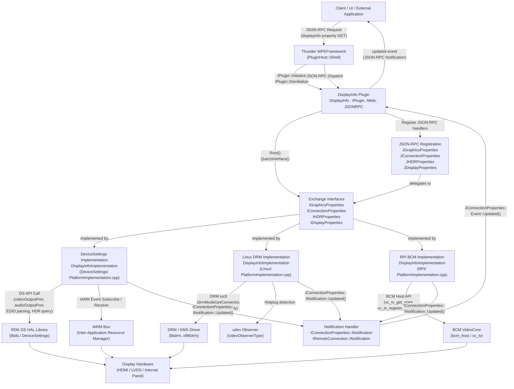

# DisplayInfo Plugin Spec

## Overview

The DisplayInfo plugin provides a unified, event-driven interface for querying display and graphics hardware information on RDK-based devices. It abstracts platform-specific details and exposes display status, resolution, EDID, HDR, and related properties via JSON-RPC to clients, external applications, and other plugins.

---

## Description

The DisplayInfo plugin is a WPEFramework (Thunder) plugin that runs as a service on RDK-based set-top boxes and TV platforms. Its primary purpose is to give clients a read-only, platform-agnostic view of the currently connected or built-in display's capabilities and state.

The plugin implements the `PluginHost::IPlugin`, `PluginHost::IWeb`, and `PluginHost::JSONRPC` interfaces. At initialization it acquires four Exchange interfaces — `IGraphicsProperties`, `IConnectionProperties`, `IHDRProperties`, and `IDisplayProperties` — from a separately activated out-of-process implementation (`DisplayInfoImplementation`). Three platform-specific implementations exist:

- **DeviceSettings** (`plugin/DeviceSettings/PlatformImplementation.cpp`): Used on RDK platforms. Communicates with the DS (Device Settings) HAL library and the IARM Bus for hardware events.
- **Linux DRM** (`plugin/Linux/PlatformImplementation.cpp`): Used on generic Linux targets. Uses the DRM/KMS subsystem and a udev observer for hotplug events.
- **RPI BCM** (`plugin/RPI/PlatformImplementation.cpp`): Used on Raspberry Pi. Uses the Broadcom VideoCore (`bcm_host`) API.

When the underlying platform sends a connection-change event (e.g., HDMI hotplug), the implementation calls `IConnectionProperties::INotification::Updated()`, which propagates through the plugin's `Notification` inner class and fires the JSON-RPC `updated` event to all subscribed clients.

Configuration (device names, file paths for EDID, HDCP, HDR, GPU memory, etc.) is read from config files or environment variables via `IConfiguration::Configure()`.

---

## Requirements

- The plugin MUST expose display connection status, resolution, EDID, HDCP protection level, HDR type, GPU memory, and related properties via a single JSON-RPC property (`displayinfo`).
- The plugin MUST notify subscribed clients with an `updated` event whenever display connection properties change (e.g., HDMI hotplug, resolution change).
- The plugin MUST be read-only; it MUST NOT provide any methods to modify display settings.
- The plugin MUST abstract platform-specific hardware details behind the `IGraphicsProperties`, `IConnectionProperties`, `IHDRProperties`, and `IDisplayProperties` Exchange interfaces.
- The plugin MUST support at least three platform backends: DeviceSettings (RDK/DS), Linux DRM/KMS, and RPI BCM.
- The plugin MUST handle the case where `IDisplayProperties` is unavailable at initialization and return `ERROR_UNAVAILABLE` for the affected JSON-RPC endpoints without failing plugin activation.
- The plugin MUST expose GPU RAM usage (total and free) via `IGraphicsProperties`.
- The plugin MUST expose HDCP protection level, HDR type, TV HDR capabilities, STB HDR capabilities, and the current HDR setting via `IHDRProperties`.
- The plugin MUST expose color space, frame rate, colour depth, quantization range, colorimetry, and EOTF via `IDisplayProperties`.
- The plugin MUST expose raw EDID data as a base64-encoded string.
- The plugin MUST register and deregister `IConnectionProperties::INotification` during `Initialize` and `Deinitialize` respectively.
- Plugin activation MUST fail with an appropriate error message if `IConnectionProperties` or `IGraphicsProperties` or `IHDRProperties` cannot be acquired.
- Configuration MUST be applied to the implementation via `IConfiguration::Configure()` during plugin initialization.

---

## Architecture / Design

---

## External Interfaces

### JSON-RPC Property: `displayinfo`

- **Endpoint:** `DisplayInfo.1.displayinfo`
- **Type:** Property (GET only)
- **Description:** Returns a composite object containing general display and graphics information for the currently connected or built-in display.
- **Input parameters:** None
- **Response fields:**

| Field | Type | Description |
|---|---|---|
| `width` | uint32 | Display width in pixels |
| `height` | uint32 | Display height in pixels |
| `connected` | bool | HDMI connection status (`true` if connected) |
| `audiopassthrough` | bool | Audio passthrough enabled |
| `totalgpuram` | uint64 | Total GPU RAM in bytes |
| `freegpuram` | uint64 | Free GPU RAM in bytes |
| `hdcpprotection` | enum | HDCP protection level: `HDCP_Unencrypted`, `HDCP_1X`, `HDCP_2X`, `HDCP_AUTO` |
| `hdrtype` | enum | Current HDR type: `HDR_OFF`, `HDR_10`, `HDR_10PLUS`, `HDR_HLG`, `HDR_DOLBYVISION`, `HDR_TECHNICOLOR`, `HDR_SDR` |
| `verticalfreq` | uint32 | Display refresh rate in Hz |
| `widthincentimeters` | uint8 | Physical display width in centimeters |
| `heightincentimeters` | uint8 | Physical display height in centimeters |
| `edid` | string | Raw EDID data, base64-encoded |
| `colorspace` | enum | Color space: `FORMAT_RGB`, `FORMAT_YCBCR444`, `FORMAT_YCBCR422`, `FORMAT_YCBCR420`, `FORMAT_OTHER` |
| `framerate` | enum | Frame rate: `FRAMERATE_24`, `FRAMERATE_25`, `FRAMERATE_30`, `FRAMERATE_50`, `FRAMERATE_60`, etc. |
| `colourdepth` | enum | Colour depth: `COLORDEPTH_8_BIT`, `COLORDEPTH_10_BIT`, `COLORDEPTH_12_BIT` |
| `quantizationrange` | enum | Quantization range: `QUANTIZATIONRANGE_UNKNOWN`, `QUANTIZATIONRANGE_LIMITED`, `QUANTIZATIONRANGE_FULL` |
| `colorimetry` | array\<enum\> | Supported colorimetry standards as reported by the display, e.g., `COLORIMETRY_XVYCC601`, `COLORIMETRY_XVYCC709`, `COLORIMETRY_SYCC601`, `COLORIMETRY_OPYCC601`, `COLORIMETRY_OPRGB`, `COLORIMETRY_BT2020YCCBCBRC`, `COLORIMETRY_BT2020RGB_YCBCR`, `COLORIMETRY_DCI_P3`, `COLORIMETRY_UNKNOWN` |
| `eotf` | enum | Electro-Optical Transfer Function: `EOTF_SDR_LUMINANCE_RANGE`, `EOTF_HDR_LUMINANCE_RANGE`, `EOTF_SMPTE_ST_2084` (HDR10), `EOTF_HLG_BT2100`, `EOTF_UNKNOWN` |
| `tvcapabilities` | array\<enum\> | HDR formats supported by the connected TV (same enum values as `hdrtype`) |
| `stbcapabilities` | array\<enum\> | HDR formats supported by the STB (same enum values as `hdrtype`) |
| `hdrsetting` | enum | Current HDR format in use (same enum values as `hdrtype`) |

- **Error conditions:**
  - `ERROR_NONE` (0): Success
  - `ERROR_UNAVAILABLE`: Returned for individual interface-backed fields if the corresponding Exchange interface (`IDisplayProperties`, `IHDRProperties`, etc.) could not be acquired at initialization.

---

### JSON-RPC Event: `updated`

- **Endpoint:** `DisplayInfo.1.updated`
- **Type:** Notification (subscribe only)
- **Description:** Fired whenever the display connection properties change (e.g., HDMI cable connected or disconnected, resolution change, HDR mode change).
- **Payload fields:**

| Field | Type | Description |
|---|---|---|
| `event` | enum | Source of the update event (values defined by `IConnectionProperties::INotification::Source`) |

---

## Performance

_Not applicable — no explicit performance requirements defined._

---

## Security

_Not applicable — no explicit security model defined. The plugin relies on Thunder's built-in plugin isolation and process sandboxing. No additional access controls or threat mitigations are defined in the current specification._

---

## Versioning & Compatibility

- Current version: **1.0.6** (Major: 1, Minor: 0, Patch: 6), as defined in `plugin/DisplayInfo.cpp`.
- The `displayinfo` property is a GET-only composite property; it is intended to be backward-compatible — new fields may be added without removing or renaming existing ones.
- The `updated` event signature is stable; the `source` payload was introduced to distinguish event sources without breaking existing subscribers.

---

## Conformance Testing & Validation

- **L1 Tests** (unit/component level): Located at `Tests/L1Tests/tests/test_DisplayInfo.cpp`. These tests validate JSON-RPC registration, property retrieval, event firing, and interface lifecycle (initialize/deinitialize).
- **L2 Tests** (integration level): Located at `Tests/L2Tests/`. CMake setup present; test cases cover end-to-end plugin behavior.
- Test configuration is driven by `Tests/L1Tests/CMakeLists.txt` and `Tests/CMakeLists.txt`.
- Coverage tooling is configured via `Tests/gcc-with-coverage.cmake` and `Tests/L1Tests/.lcovrc_l1`.

---

## Covered Code

- `plugin/DisplayInfo.cpp` — `DisplayInfo::Initialize`, `DisplayInfo::Deinitialize`, `DisplayInfo::Information`, `DisplayInfo::Inbound`, `DisplayInfo::Process`, `DisplayInfo::Info`, `DisplayInfo::Deactivated`
- `plugin/DisplayInfo.h` — `DisplayInfo` class declaration, `Notification` inner class
- `plugin/DisplayInfoJsonRpc.cpp` — `DisplayInfo::RegisterAll`, `DisplayInfo::UnregisterAll`, `DisplayInfo::get_displayinfo`, `DisplayInfo::event_updated`
- `plugin/Module.cpp` — Module registration
- `plugin/Module.h` — Module header
- `plugin/DeviceSettings/PlatformImplementation.cpp` — `DisplayInfoImplementation` (DeviceSettings/IARM backend): `IGraphicsProperties`, `IConnectionProperties`, `IHDRProperties`, `IDisplayProperties` implementations
- `plugin/DeviceSettings/SoC_abstraction.h` — SoC abstraction interface for DeviceSettings
- `plugin/Linux/PlatformImplementation.cpp` — `DisplayInfoImplementation` (Linux DRM/KMS backend), `UdevObserverType`, `DRMConnector` usage
- `plugin/Linux/DRMConnector.h` — DRM connector abstraction
- `plugin/RPI/PlatformImplementation.cpp` — `DisplayInfoImplementation` (RPI BCM/VideoCore backend)

---

## Open Queries

- No explicit error handling model is documented for cases where EDID parsing fails or returns partial data; it is unclear whether partial field values or a full error response should be returned.
- No explicit security model or access control policy is defined. It is unclear whether all clients should have unrestricted read access to EDID and HDCP status.
- Platform-specific quirks (e.g., EDID parsing across DeviceSettings, DRM, and BCM backends) may not be fully abstracted; cross-platform parity of all response fields is not guaranteed.
- The specific behavioral requirements of the `colorimetry` field (e.g., return behavior when no display is connected, distinction between built-in and external display sources) are subject to the archived change `openspec/changes/archive/2026-04-16-displayinfo-colorimetry-property/` and are out of scope for this baseline spec. These requirements should be consulted before implementing or testing that field.
- The `IDisplayProperties` interface is marked non-essential at initialization; it is unclear which fields in the `displayinfo` response are affected when it is unavailable, and whether clients are expected to handle partial responses.

---

## References

- Thunder (WPEFramework) Plugin documentation: https://rdkcentral.github.io/Thunder/
- RDK Device Settings (DS) HAL: https://wiki.rdkcentral.com/display/RDK/Device+Settings+Library
- EDID standard: VESA Enhanced Extended Display Identification Data (E-EDID) Standard
- HDCP specification: Digital Content Protection LLC
- CTA-861 (formerly CEA-861): A DTV Profile for Uncompressed High Speed Digital Interfaces (defines HDR, colorimetry, quantization range metadata)
- Related Exchange interfaces: `IGraphicsProperties`, `IConnectionProperties`, `IHDRProperties`, `IDisplayProperties` (defined in Thunder/WPEFramework interfaces repository)

---

## Change History

- [2026-04-23] - openspec-templater - Regenerated to match spec template format.
